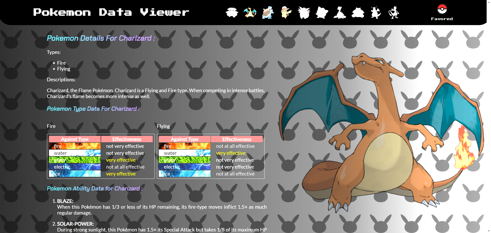

# README

This is a project I completed after learning JavaScript, HTML and CSS for 1 month. It is a website displaying Pokemon Data. All data are retrieved from pokemon.com by using API calls. Here is a sample screen-shot of the website:

